## 2021 edition

|  
`// TRIPLE NESTED LOOP`
                                  |  
[Rule 30](https://www.wolframalpha.com/input/?i=rule+30) ([elementary cellular automaton](https://en.wikipedia.org/wiki/Rule_30))
 |  
Make something human.
                          |
| --------------------------------------------------------------------------------------------------------------------------- | ----------------------------------------------------------------------------------------------------------------------------------------------------------------------------------------------------- | ------------------------------------------------------------------------------------------------------------------ |
|  
Small areas of symmetry.
                                |  
Do some code golf!
                                                                                                                |  
Triangle subdivision.
                          |
|  
Generate some rules, then follow them by hand on paper.
 |  
Curve only.
                                                                                                                       |  
Interference patterns.
                         |
|  
`// TREE`
                                           |  
Use a non-computer random source
                                                                                              |  
Use an API
                                 |
|  
Do not repeat.
                                      |  
`// SUBDIVISION`
                                                                                                              |  
Let someone else decide the rules.
         |
|  
Circles only
                                        | [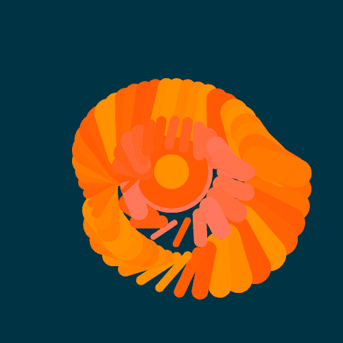](./day_17/day_17.js) 
Draw a line, pick a new color, move a bit.
                                                                                    | [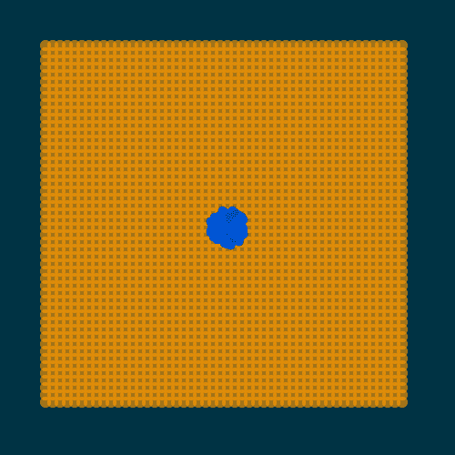](./day_18/day_18.js) 
One process grows, another process prunes.
 |
| [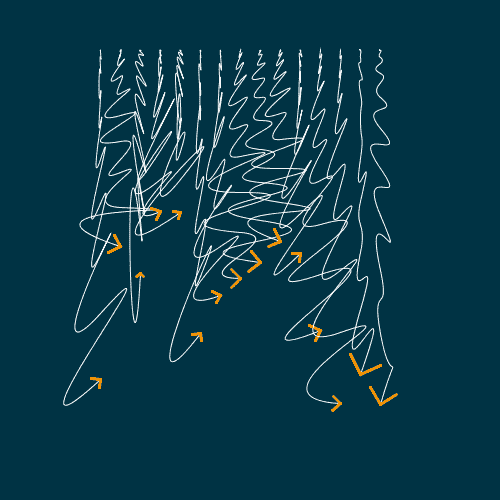](./day_19/day_19.js) 
Increase the randomness along the Y-axis.
           |  
No loops.
                                                                                                                     | [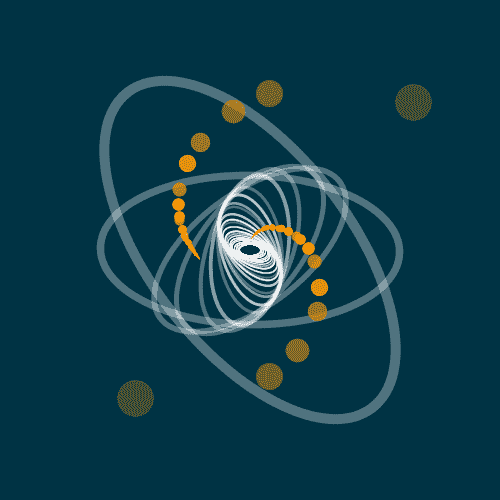](./day_21/day_21.js) 
`DRAW(x);`
                                 |
| [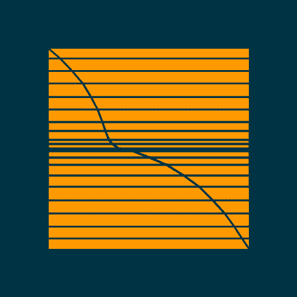](./day_22/day_22.js) 
Draw a line. Wrong answers only.
                    | [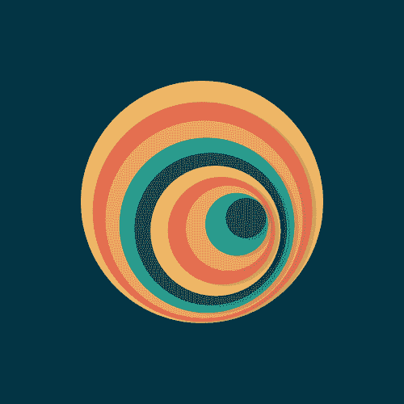](./day_23/day_23.js) 
**#264653** **#2a9d8f** ...
                                                                                                   | [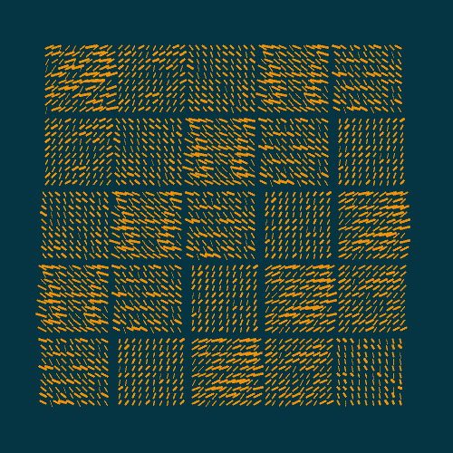](./day_24/day_24.js) 
500 lines
                                  |
| [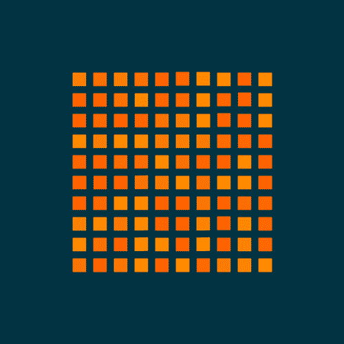](./day_25/day_25.js) 
Make a grid of permutations of something.
           | [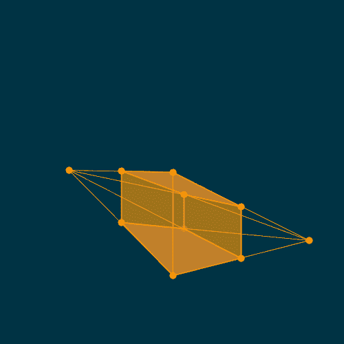](./day_26/day_26.js) 
2D perspective
                                                                                                                | [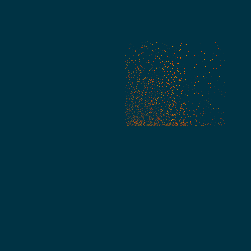](./day_27/day_27.js) 
Monochrome gradients without lines.
        |
| [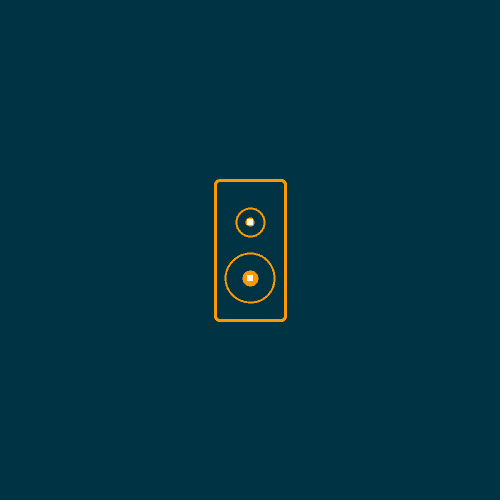](./day_28/day_28.js) 
Use sound.
                                          | [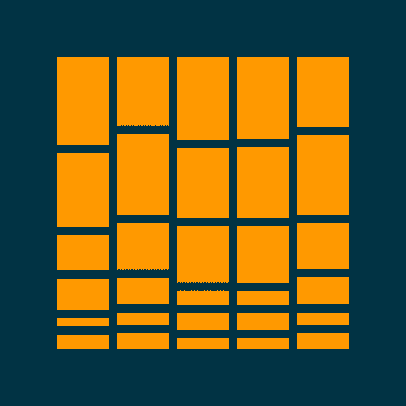](./day_29/day_29.js) 
Any shape, none can touch.
                                                                                                    |                                                                                                                    |
|                                                                                                                             |                                                                                                                                                                                                       |                                                                                                                    |
|                                                                                                                             |                                                                                                                                                                                                       |                                                                                                                    |
