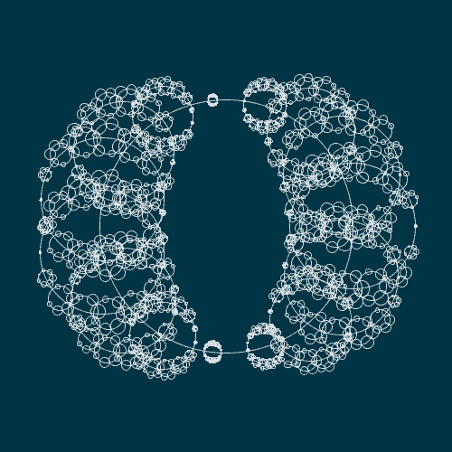
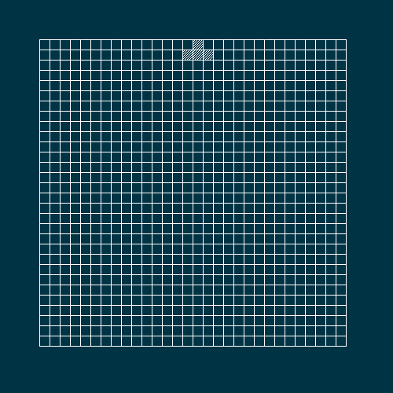
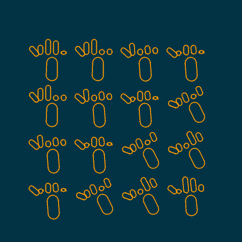
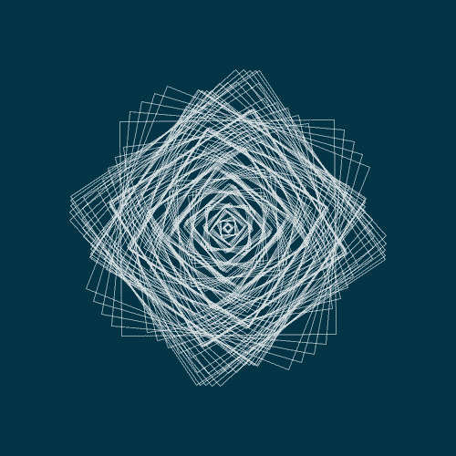
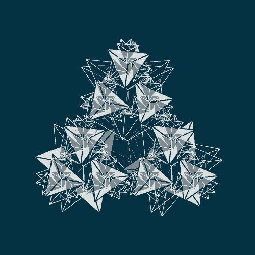
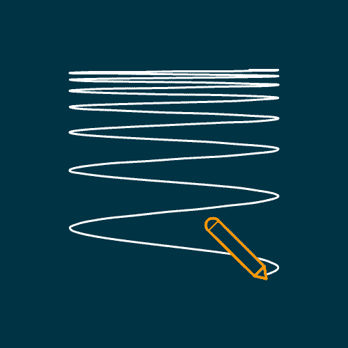
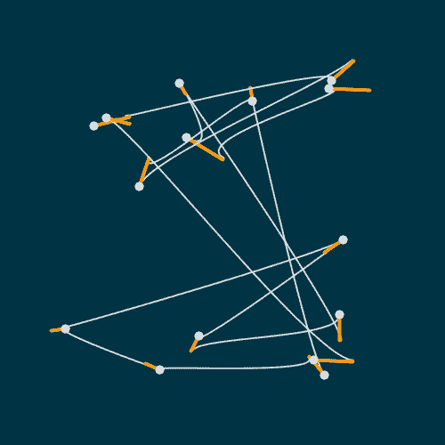
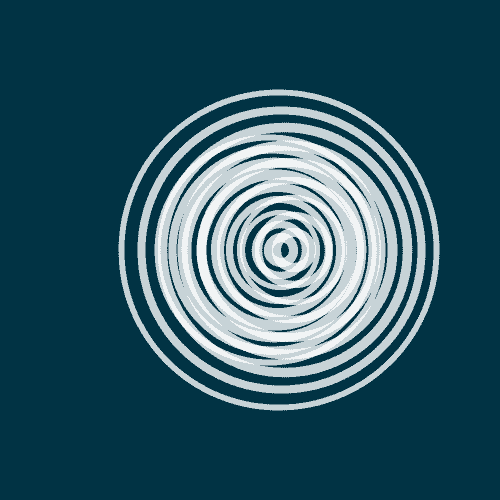
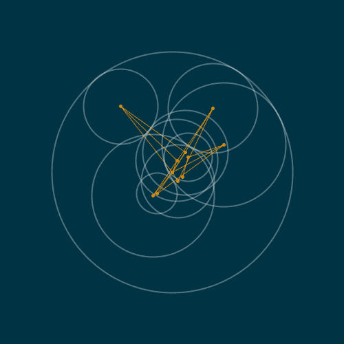
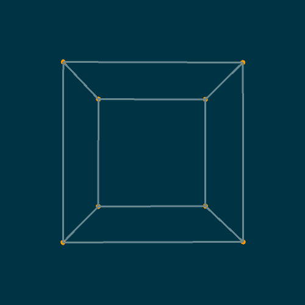

# Genuary

This repository stores the programs made during the [genuary](https://genuary2021.github.io/) event.

> GENUARY is an artificially generated month of time where we build code that makes beautiful things.
>

You can click on any animation below to open the source file, enjoy!

## 2021 edition

|  
`// TRIPLE NESTED LOOP`
 |  
[Rule 30](https://www.wolframalpha.com/input/?i=rule+30) ([elementary cellular automaton](https://en.wikipedia.org/wiki/Rule_30))
 |  
Make something human.
 |
| ------------------------------------------------------------ | ------------------------------------------------------------ | ------------------------------------------------------------ |
|  
Small areas of symmetry.
 |  
Do some code golf!
 |  
Triangle subdivision.
 |
|  
Generate some rules, then follow them by hand on paper.
 |  
Curve only.
 |  
Interference patterns.
 |
|  
`// TREE`
 |  
Use a non-computer random source
 |  
Use an API
 |
|  
Do not repeat.
 |  
`// SUBDIVISION`
 |  
Let someone else decide the general rules of your piece.
 |
|  
Circles only
 |                                                              |                                                              |
|                                                              |                                                              |                                                              |
|                                                              |                                                              |                                                              |
|                                                              |                                                              |                                                              |
|                                                              |                                                              |                                                              |
|                                                              |                                                              |                                                              |
|                                                              |                                                              |                                                              |

## Links

- [genuary home page](https://genuary2021.github.io)

- [p5js website](p5js.org/)

- [p5js web editor](https://editor.p5js.org/)

  

## License
[MIT](https://choosealicense.com/licenses/mit/)